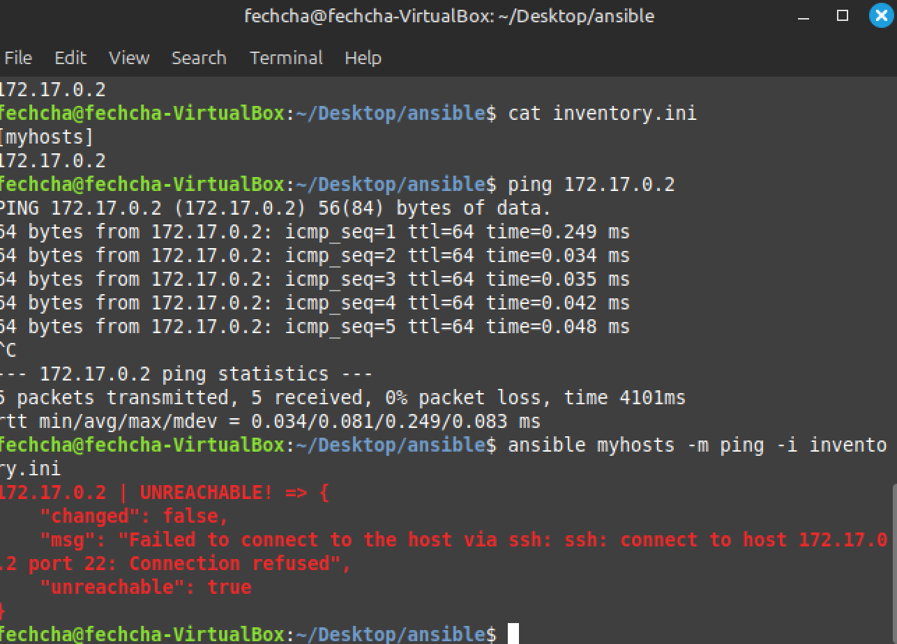

# **Ansible Overview**
- **Purpose**: Automates tasks with playbooks that declare the desired system state. Ansible ensures the system (local or remote) remains in that state.
- **Features**: 
  - **Agent-less architecture**: No need to install agents on remote systems.
  - **Idempotence**: Running the same task multiple times has no additional effect if the state is already as desired.
  - **Scalability**: Modular, flexible, and easy to manage large environments.

---

## **Building an Inventory**
- An inventory defines the systems managed by Ansible.
- Example `inventory.ini` file:
  ```ini
  [myhosts]
  10.0.0.0
  10.0.0.1
  10.0.0.2
  ```
- Verify inventory:
  ```bash
  ansible-inventory -i inventory.ini --list
  ```
- Ping all hosts in a group:
  ```bash
  ansible myhosts -m ping -i inventory.ini
  ```
- YAML equivalent:
  ```yaml
  myhosts:
    hosts:
      host_1:
        ansible_host: 10.0.0.0
      host_2:
        ansible_host: 10.0.0.1
      host_3:
        ansible_host: 10.0.0.2
  ```

---

### **Project 1: Managing Docker Containers with Ansible**
- Ansible can:
  - Start, stop, or remove containers.
  - Build/pull Docker images.
  - Configure running containers.
  - Orchestrate containers across multiple hosts.

#### **Prerequisites**
- Install Docker and Python Docker SDK (`pip install docker`).
- Install the Docker Ansible collection:
  ```bash
  ansible-galaxy collection install community.docker
  ```

#### **Sample Playbook**
Deploy an Nginx container:
```yaml
- name: Deploy a Docker container
  hosts: localhost
  tasks:
    - name: Pull the latest nginx image
      community.docker.docker_image:
        name: nginx
        tag: latest
        source: pull

    - name: Start the nginx container
      community.docker.docker_container:
        name: nginx-container
        image: nginx:latest
        state: started
        ports:
          - "8080:80"
```

---

### **Project 2: Managing Docker Containers in an Inventory**
#### **Problem: Ansible Cannot Ping Docker Container**
- **Ping works**: The container responds to ICMP packets.
- **Ansible ping fails**: By default, Ansible requires SSH for connection.



---

### **Solutions**
#### **Option 1: Use Ansible's `docker` Connection**
- Directly manage containers via the Docker API without SSH.

**Steps**:
1. Update inventory file:
   ```ini
   [docker]
   172.17.0.2 ansible_connection=docker
   ```
2. Test connection:
   ```bash
   ansible docker -m ping
   ```
3. Run tasks or playbooks.

**Advantages**:
- No SSH setup required.
- Simplifies container management.

---

#### **Option 2: Enable SSH Inside the Container**
- Install and configure SSH inside the container.

**Steps**:
1. Install SSH server in the container:
   ```bash
   apt update && apt install -y openssh-server
   service ssh start
   ```
2. Expose container SSH port:
   ```bash
   docker run -d -p 2222:22 <image>
   ```
3. Update inventory:
   ```ini
   [myhosts]
   127.0.0.1 ansible_port=2222 ansible_user=root ansible_password=<password>
   ```
4. Use Ansible as usual.

---

#### **Option 3: Use `local` Connection**
- Run Ansible tasks directly on the Docker host (useful for local setups).

**Steps**:
1. Update inventory:
   ```ini
   [myhosts]
   172.17.0.2 ansible_connection=local
   ```
2. Test connection:
   ```bash
   ansible myhosts -m ping
   ```
3. Run playbooks.

---

### **Comparison of Connection Options**

| Feature                      | `docker` Connection      | SSH (with container)    | `local` Connection        |
|------------------------------|--------------------------|--------------------------|---------------------------|
| **Use Case**                 | Direct container management | Standard SSH workflows   | Local host and containers |
| **SSH Required in Container**| No                       | Yes                      | No                        |
| **Ease of Setup**            | High                     | Medium                   | High                      |
| **Scope**                    | Docker API only          | Any SSH-capable system   | Local management only     |

## **Creating a playbook:**

